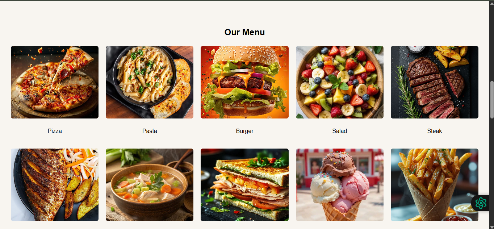

# Ex.07 Restaurant Website
# Date:
# AIM:
To develop a static Restaurant website to display the food items and services provided by them.

# DESIGN STEPS:
## Step 1:
Requirement collection.

## Step 2:
Creating the layout using HTML and CSS.

## Step 3:
Updating the sample content.

## Step 4:
Choose the appropriate style and color scheme.

## Step 5:
Validate the layout in various browsers.

## Step 6:
Validate the HTML code.

## Step 7:
Publish the website in the given URL.

# PROGRAM:
```
<!DOCTYPE html>
<html lang="en">
<head>
  <meta charset="UTF-8">
  <meta name="viewport" content="width=device-width, initial-scale=1.0">
  <title>Little Lemon Restaurant</title>
  <style>
    body {
      font-family: Arial, sans-serif;
      margin: 0;
      padding: 0;
      background-color: #f8f5f0;
    }
    header {
      text-align: center;
      padding: 20px;
      background-color: #ece8d9;
    }
    nav {
      display: flex;
      justify-content: center;
      background-color: #4a4a4a;
      padding: 10px;
    }
    nav a {
      color: #fff;
      text-decoration: none;
      margin: 0 20px;
      font-weight: bold;
      font-size: 18px;
    }
    nav a:hover {
      color: #ffcc00;
    }

    
    .banner {
      position: relative;
      text-align: center;
      color: white;
      overflow: hidden;
    }
    .banner img {
      width: 100%;
      height: 350px;       
      object-fit: cover;   
      display: block;
    }
    .banner-text {
      position: absolute;
      top: 50%;
      left: 50%;
      transform: translate(-50%, -50%);
      background: rgba(0,0,0,0.5);
      padding: 20px;
      border-radius: 8px;
    }
    .banner-text h1 {
      font-size: 32px;
      font-weight: bold;
      margin: 0;
    }
    .banner-text p {
      margin: 10px 0 0;
    }

    
    .container {
      display: flex;
      justify-content: space-around;
      padding: 30px;
      flex-wrap: wrap;
      gap: 20px;
    }
    .card {
      background-color: #fdf5ee;
      border-radius: 8px;
      padding: 20px;
      width: 30%;
      min-width: 250px;
      box-shadow: 0 2px 6px rgba(0,0,0,0.1);
      text-align: center;
    }
    .card img {
      width: 100%;
      height: 200px;       
      object-fit: cover;
      border-radius: 6px;
    }

    footer {
      background-color: #4a4a4a;
      color: white;
      text-align: center;
      padding: 15px;
      margin-top: 20px;
    }

    .menu-items, .admin, .contact {
      padding: 30px;
      text-align: center;
    }

    
    .grid {
      display: grid;
      grid-template-columns: repeat(auto-fit, minmax(200px, 1fr));
      gap: 20px;
    }
    .grid img {
      width: 100%;
      height: 200px;       
      object-fit: cover;
      border-radius: 6px;
    }

    
    .admin-grid {
      display: grid;
      grid-template-columns: repeat(auto-fit, minmax(250px, 1fr));
      gap: 20px;
    }
    .admin-card {
      background: #fff5e6;
      padding: 15px;
      border-radius: 6px;
      box-shadow: 0 2px 6px rgba(0,0,0,0.1);
      text-align: center;
    }
    .admin-card img {
      width: 100%;
      height: 300px; 
      object-fit: cover;
      border-radius: 6px;
    }
  </style>
</head>
<body>
  <header>
    <h1>LITTLE LEMON</h1>
  </header>

  <nav>
    <a href="#home">Home</a>
    <a href="#menu">Menu</a>
    <a href="#admin">Administration</a>
    <a href="#contact">Contact Us</a>
  </nav>
  <section id="home">
    <div class="banner">
      
      <div class="banner-text">
        <h1>30% Off This Weekend</h1>
        <p>Enjoy our delicious meals at discounted prices this weekend only!</p>
      </div>
    </div>

    <div class="container">
      <div class="card">
        <h2>Our New Menu</h2>
        
      </div>
      <div class="card">
        <h2>Book a table</h2>
        
      </div>
      <div class="card">
        <h2>Opening Hours</h2>
        
      </div>
    </div>
  </section>
  <section id="menu" class="menu-items">
    <h2>Our Menu</h2>
    <div class="grid">
      <div><p>Pizza</p></div>
      <div><p>Pasta</p></div>
      <div><p>Burger</p></div>
      <div><p>Salad</p></div>
      <div><p>Steak</p></div>
      <div><p>Fish</p></div>
      <div><p>Soup</p></div>
      <div><p>Sandwich</p></div>
      <div><p>Ice Cream</p></div>
      <div><p>Fries</p></div>
      <div><p>Taco</p></div>
      <div><p>Cake</p></div>
    </div>
  </section>
  <section id="admin" class="admin">
    <h2>Our Administration</h2>
    <div class="admin-grid">
      <div class="admin-card"><h3>John Doe</h3><p>Manager</p></div>
      <div class="admin-card"><h3>Jane Smith</h3><p>Head Chef</p></div>
      <div class="admin-card"><h3>David Lee</h3><p>Assistant Manager</p></div>
      <div class="admin-card"><h3>Emily Clark</h3><p>Finance Officer</p></div>
      <div class="admin-card"><h3>Michael Brown</h3><p>Bar Supervisor</p></div>
      <div class="admin-card"><h3>Sarah Wilson</h3><p>Event Manager</p></div>
    </div>
  </section>
  <section id="contact" class="contact">
    <h2>Contact Us</h2>
    <p>Address: saveetha eng college , thandalam</p>
    <p>Phone: +91 8825684026</p>
    <p>Email: web@littlelemon.com</p>
  </section>

  <footer>
    <p> Designed by : kaviraj.p</p>
  </footer>
</body>
</html>

```
# OUTPUT:





# RESULT:
The program for designing software company website using HTML and CSS is completed successfully.
